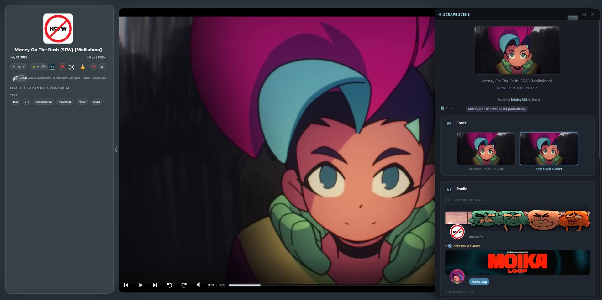
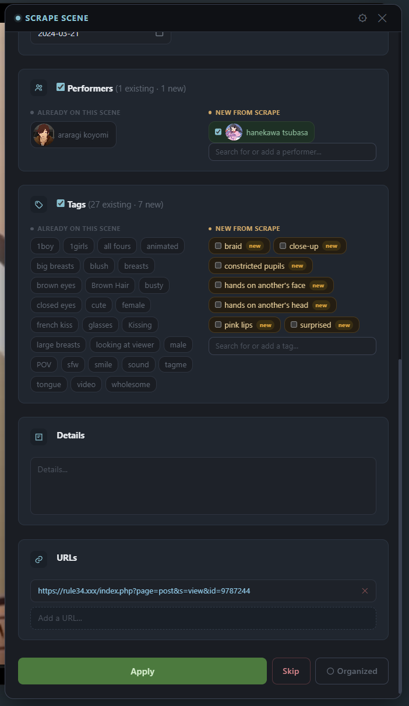
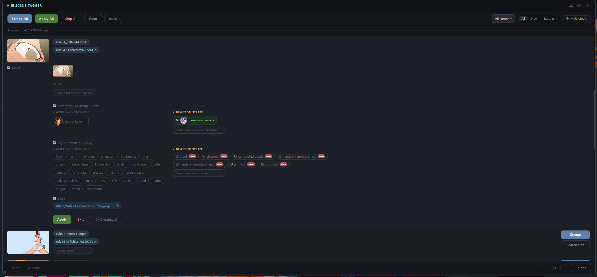
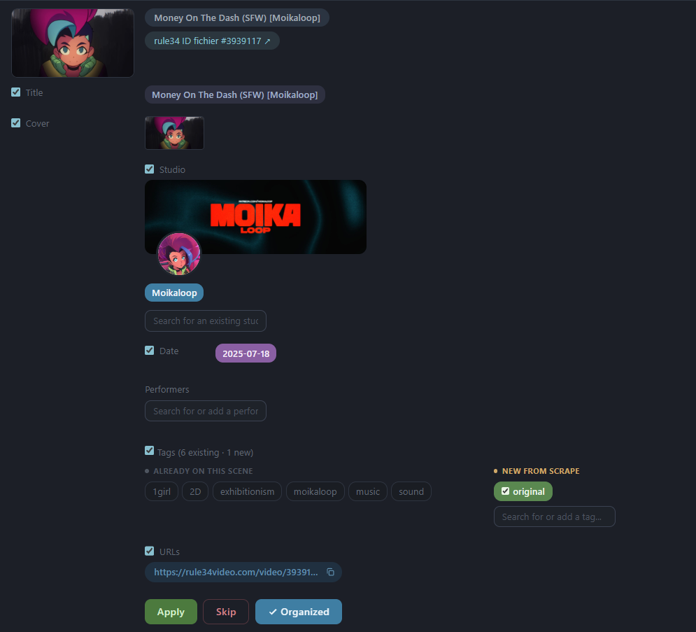
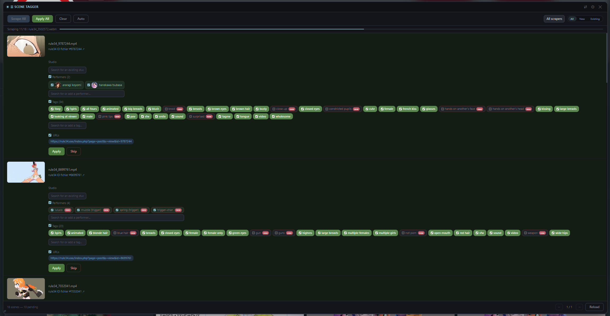
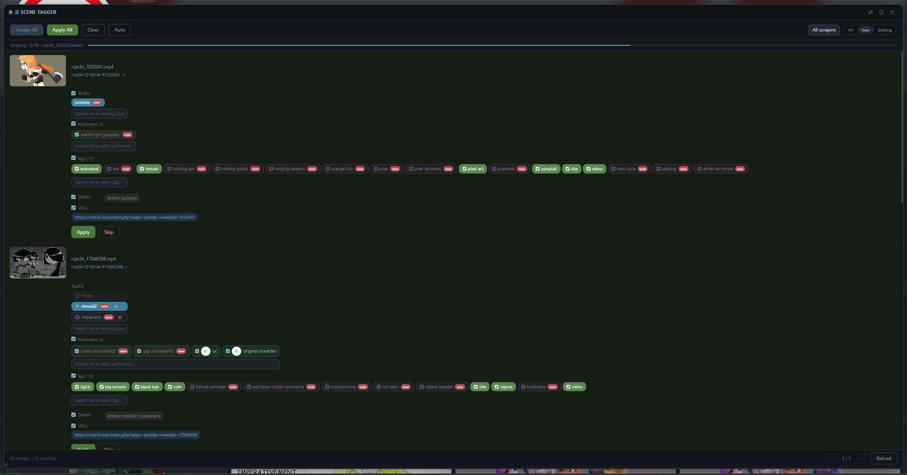
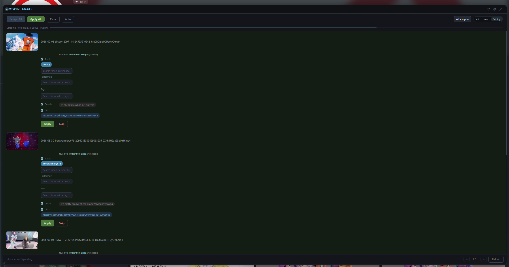
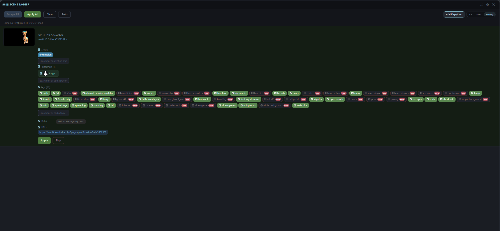
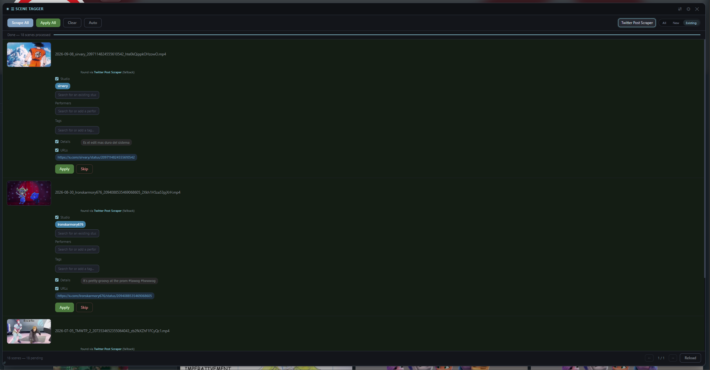

# Scene Tagger

Bulk-scrape multiple Stash scenes in a row from a floating panel, review and
edit each proposed field before applying it, and move on to the next one
without reloading the page. Works on the `/scenes` list, on a studio's own
**Scenes** tab, and on a single scene's page (**Scrape Scene** popup).
JavaScript only - no backend, no dependencies.

This plugin was originally built around **rule34** and **rule34video**'s
scraping logic - fragment/URL-based custom scrapers with their own quirks
(filename ID matching, fallback between them, etc.). It grew into scraping
many scenes in a row using several scrapers in a fallback chain, reviewing
each result, and batch-applying them - all in one tool.

Stash's native Tagger page already lets you review scraped results, but it's
built around one scraper/source at a time; combining a multi-scraper
fallback chain, inline review, and batch apply into a single workflow is
what this plugin adds on top. It has since been adapted to work with
stash-box sources too (StashDB, ThePornDB, etc.) - the rule34 origin shaped
how it works, but it isn't limited to it.

This is a personal tool, shared as-is because it turned out complete enough
to be useful to others - not actively maintained for every environment or
edge case, but it's held up well for daily use.

## Installation

1. In Stash: **Settings → Plugins → Add Source**, with the raw URL of this
   repo's `index.yml` file (e.g.
   `https://raw.githubusercontent.com/jojo-topo/stash-plugins/master/index.yml`).
2. Install **Scene Tagger** from the list.
3. Go to `/scenes`, a "Scene Tagger" button appears in the toolbar. On a
   scene's own page, a Scene Tagger button appears in its toolbar too.

## How to use it

### Bulk: the scene list

1. Go to `/scenes` (or a studio's **Scenes** tab) and click the
   **Scene Tagger** button in the toolbar.

   

2. Click **Scrape All** to run the configured scraper chain on every visible
   scene, or **Scrape** on an individual row.
3. Review each result: uncheck anything you don't want, adjust the
   studio/performers/tags via the search boxes if needed.
4. Click **Apply** on a row (or **Apply All** once several rows are ready)
   to write the changes to Stash.
5. Use **Skip** to leave a scene untouched and move on.

The **Auto / Manual** button in the panel header switches between running
the whole scraper chain and picking a single scraper yourself.

### One scene: the Scrape Scene popup

Open a scene's page and click the Scene Tagger button in its toolbar (or the
Scene Tagger button on the scene's **Edit** tab). A **Scrape Scene** popup
runs the scrapers for that one scene and shows the result as one card per
field, each comparing what's **already on the scene** with what's **new from
the scrape**. Apply, Skip and **Organized** work like in the list.

## Features

### Bulk scraping with automatic fallback

Configure a chain of scrapers in order of priority (drag to reorder in
Settings). If the first scraper finds nothing for a scene, the plugin
automatically tries the next one in the chain - no need to manually pick a
different scraper and retry. A small hint shows which scraper actually
matched when it wasn't the first one.

An optional toggle lets it try the scene's already-saved URL
(`scrapeSceneURL`) before the chain, useful when a scene already carries a
source URL but hasn't been scraped yet.

### Review before applying - nothing happens silently

Each scraped scene shows an inline, editable result: title, date, code,
director, cover image, performers, studio, tags, details, and URLs. Every
field has its own checkbox - uncheck anything you don't want applied, edit
the studio/performers/tags before committing. Nothing is written to Stash
until you click **Apply**.

### Existing vs new data, field by field

In the Scrape Scene popup every field shows **Already on this scene** next to
**New from scrape**, so you see exactly what will change: the cover
(current thumbnail or scraped one), studio, performers, tags, details
(always editable), URLs (add or remove one by one) and a calendar picker for
the date. What's already on the scene is always kept when you apply.

The same split is available in the bulk list as an option (**Split existing /
new data** in Settings → Display), stacked or side by side. Fields with
nothing to compare keep their compact layout, and the "New from scrape" title
hides itself when nothing is new.

### Studio cards with logo and banner

The studio field shows a card: the studio's logo (round when it's roughly
square, rounded corners when it's wide) and, when the studio has one, a cover
banner with the logo overlapping it. It works for the scraped studio, for the
studio already on the scene, and for any studio you pick through the search
box; clicking the logo opens the studio's page.

The banner is read from a `bg:<url>` line in the studio's **Details** (the
format used by the replaceBackground plugin). Studios without one simply show
their logo. When several studios are detected, hovering one in the list shows
its banner and logo. Both the banner and the logo can be hidden in Settings.

### Search title

When no scraper finds a scene, **Search title** lets you search by title
instead: pick any stash-box or any scraper that supports searching by name,
then choose the right result from the list (with thumbnails). The full scene
page is fetched for the chosen result, so tags and performers come along too.
Stash-boxes are listed first: StashDB, ThePornDB, FansDB, other stash-boxes,
JAVStash, then the other scrapers.

### Stash ID scraping

When a result comes from a stash-box, its Stash ID is shown as a checkable row
and saved on Apply. Like in native Stash, it replaces the entry for that
endpoint and keeps the Stash IDs from other endpoints.

### Search and create on the fly

Performers, studios, and tags all have a live search box built into the
panel - start typing to search the existing Stash database, or create a new
entry directly if nothing matches. No need to leave the panel or the page.

Performer results (both in the search dropdown and once added to a scene)
show a round avatar pulled from their existing Stash photo when they already
have one - hover it for a larger preview, handy for telling apart
similarly-named performers before committing to one.

### New-entity detection

Studios, performers, and tags not yet present in Stash are flagged with a
**new** badge. An option lets new entries be checked by default automatically
(handy for a first big import) or left unchecked for manual review
(safer when merging into an existing library).

Studio detection also checks **aliases**, not just the primary name - a
studio scraped under an alternate spelling won't be wrongly flagged as new
or create a duplicate.

### Mark as organized on Apply

Scenes can be marked as organized right when you apply. A global toggle
pre-checks it (only for scenes where a studio was actually matched - no result
or no studio stays unchecked, so you can still review those), and a per-scene
**Organized** button overrides it manually.

### Multi-studio detail parsing

If a scene's `details` field contains a line like
`Artists: name1[id1] | name2 | name3[id3]`, the plugin detects every
candidate and lets you pick the correct one via radio buttons - instead of
blindly taking whatever the scraper put in the `studio` field. This is a
convention specific to the
[rule34-python scraper](https://github.com/jojo-topo/stash-scrapers); with
any other scraper this simply doesn't trigger and the plugin falls back to
the scraper's own `studio` field.

### Studio blacklist

Maintain a list of studio names to ignore (useful for VA/compilation
channels that shouldn't become a "studio" entry) - candidates matching the
blacklist are skipped automatically unless they're the only option.

### Manual fallback when scraping fails

Optional setting: instead of a plain error message, a failed scrape shows
the same review panel - empty, ready to fill in studio/performers/tags/details
by hand. A **Retry** button stays available to attempt the automatic scrape
again. A further sub-option adds a manual title field.

### Hover preview with scrub controls

Hovering a scene thumbnail plays a preview clip (Stash's own generated one
when a scene has one, otherwise the source video streamed directly - no
companion plugin needed). Optional scrub controls: the mouse wheel seeks
through the preview (step is a percentage of the video's duration, with light
acceleration), **Shift** freezes the frame, and there is an optional progress
bar and arrow-key seek. The controls can be enabled separately for the bulk
panel and the popup.

### Works on studio pages too

The same panel is available on a studio's own **Scenes** tab
(`/studios/<id>`), not just the global `/scenes` list - handy for cleaning
up one studio's backlog without the global filter noise.

### Persistent, non-disruptive panel

Changing page, filter, or sort on `/scenes` refreshes the list in place -
the panel never closes and reopens on its own, and rows already scraped in
this session keep their result if they're still in view.

### Live filtering after a bulk scrape

Once several scenes are scraped, filter the list by **All / New / Existing**
(whether the detected studio is new or already in your database) and by
which scraper actually matched, to quickly focus on the scenes that need
attention.

## Settings

Open the gear icon on the panel header. Settings are grouped into
**Scraping**, **Checked by default**, **On apply** and **Display**:

- **Scraping** - the scraper chain (drag to reorder, toggle scrapers on/off;
  the block is collapsible), "Use existing URL if available", manual fallback
  on scrape failure (+ manual title sub-option)
- **Checked by default** - auto-check for new studios / performers / tags /
  details, prefer the existing studio
- **On apply** - auto-organize on Apply
- **Display** (all off by default unless noted)
  - Hide studio banner / Hide studio logo
  - Cover under the thumbnail (instead of aligned with the title)
  - Full Details editor in the mass list (instead of the short preview)
  - Show the scene title instead of the file name (when it has one)
  - Split existing / new data, with a **side by side** sub-option
  - Hover preview, scrub controls, progress bar and keyboard seek (step and
    acceleration values are under a collapsible "Advanced scrub settings")
  - Hide the Scene Tagger buttons on the scene page / Edit tab, and the
    Auto/Manual toggle on the scene page
- The settings panel itself can be resized: drag the bar at its bottom edge,
  double-click it to reset.

### Compact mode

A separate button in the panel's title bar (not in the settings menu above)
toggles a compact floating panel mode - a smaller, draggable window docked to
a corner instead of the full-width bar, for when the full panel takes up too
much space. The layout options above apply to the regular panel, not to
compact mode.

## Known limitations

- Mainly tested on a recent Stash version (v0.31.x) - not guaranteed on
  older versions.
- Studio banners need a `bg:<url>` line in the studio's Details; without it
  only the logo is shown.

## License

MIT
