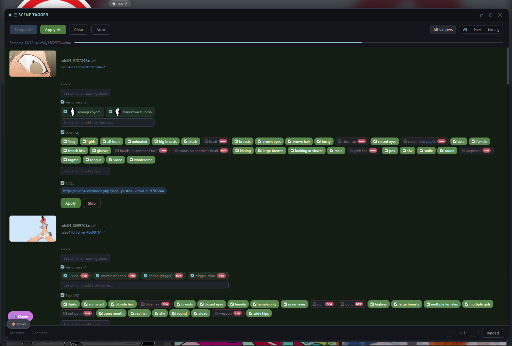
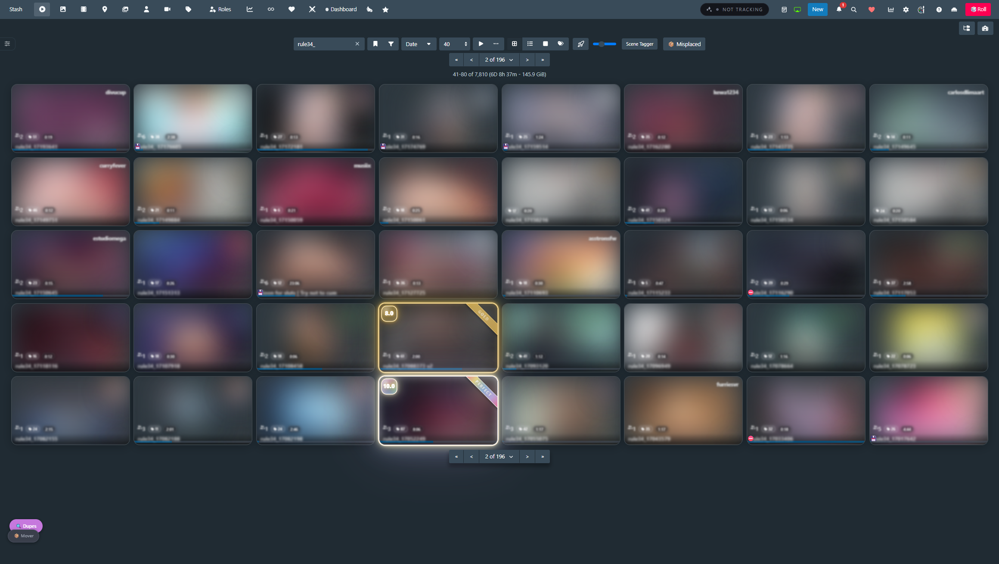
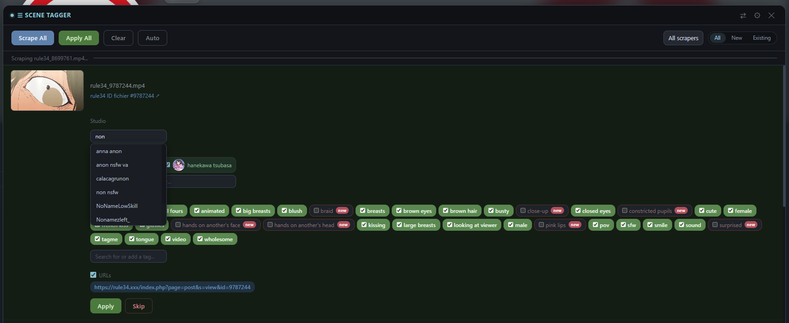
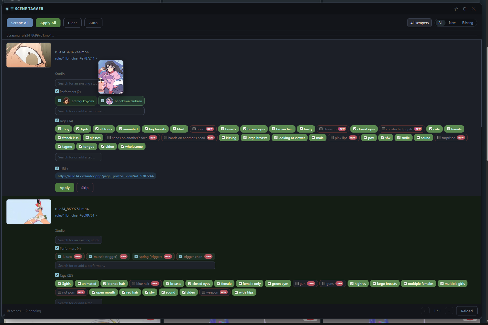
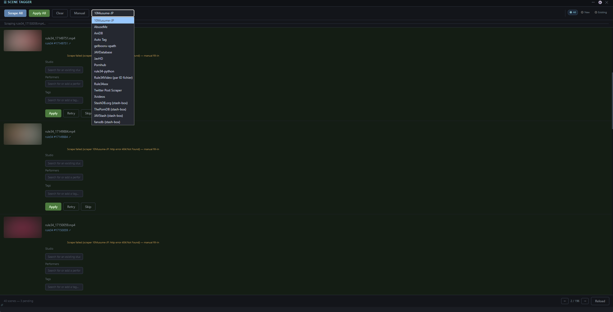
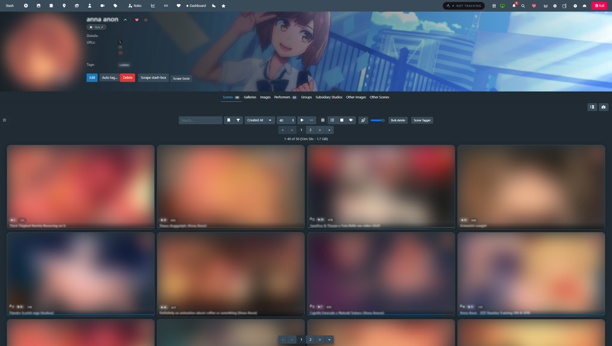
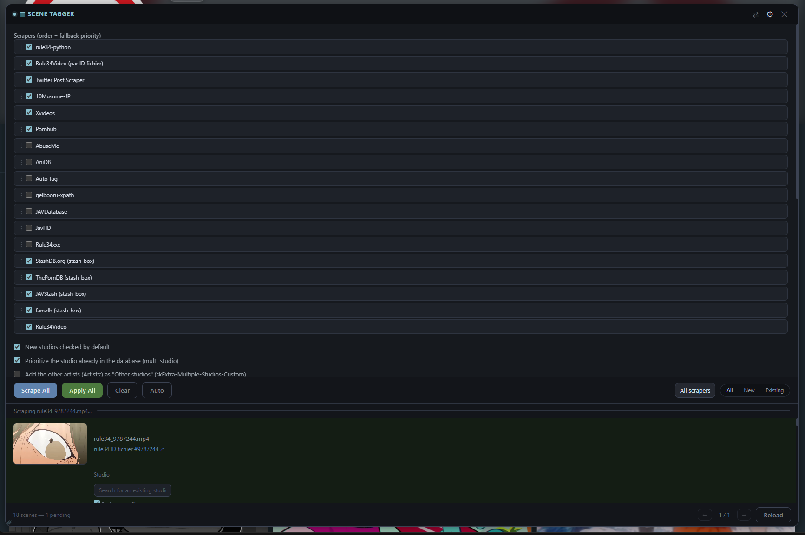
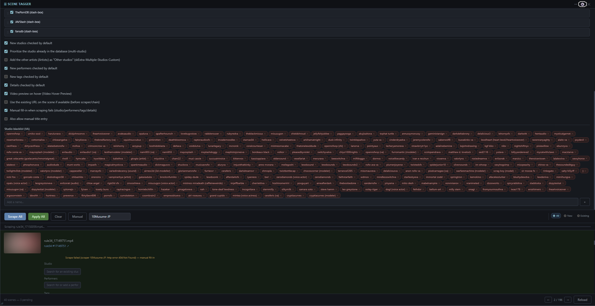
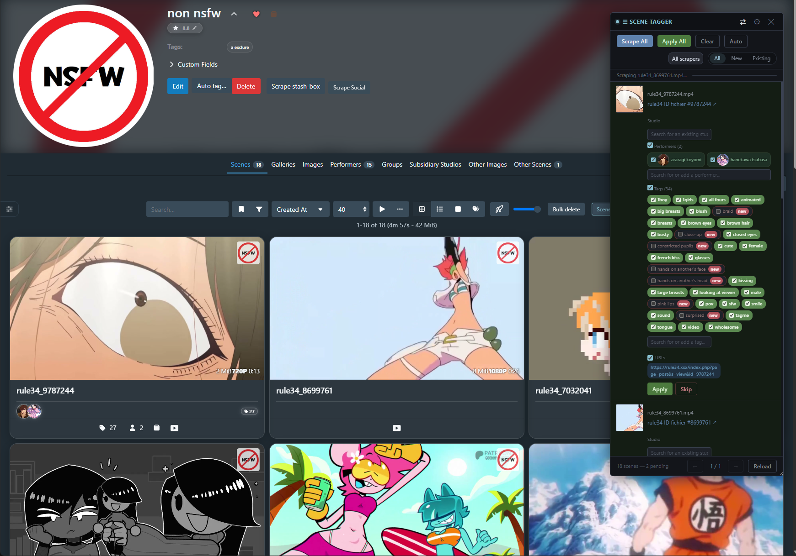

# Scene Tagger

Bulk-scrape multiple Stash scenes in a row from a floating panel, review and
edit each proposed field before applying it, and move on to the next one
without reloading the page. Works on the `/scenes` list and on a studio's
own **Scenes** tab. JavaScript only - no backend, no dependencies.

Built originally for scraping **rule34** and **rule34video** sources via
community/URL-based scrapers - the kind of workflow Stash's stash-box-centric
native tools (Scrape button, Identify task, Tagger page) aren't really built
for. It isn't rule34-specific in how it works (any scene scraper can be added
to the chain), that's just the itch it was built to scratch.

This is a personal tool, shared as-is because it turned out complete enough
to be useful to others - not actively maintained for every environment or
edge case, but it's held up well for daily use.

## Installation

1. In Stash: **Settings → Plugins → Add Source**, with the raw URL of this
   repo's `index.yml` file (e.g.
   `https://raw.githubusercontent.com/jojo-topo/stash-plugins/master/index.yml`).
2. Install **Scene Tagger** from the list.
3. Go to `/scenes`, a "Scene Tagger" button appears in the toolbar.

## How to use it

1. Go to `/scenes` (or a studio's **Scenes** tab) and click the
   **Scene Tagger** button in the toolbar.

   

2. Click **Scrape All** to run the configured scraper chain on every visible
   scene, or **Scrape** on an individual row.
3. Review each result: uncheck anything you don't want, adjust the
   studio/performers/tags via the search boxes if needed.
4. Click **Apply** on a row (or **Apply All** once several rows are ready)
   to write the changes to Stash.
5. Use **Skip** to leave a scene untouched and move on.

## Features

### Bulk scraping with automatic fallback

Configure a chain of scrapers in order of priority (drag to reorder in
Settings). If the first scraper finds nothing for a scene, the plugin
automatically tries the next one in the chain - no need to manually pick a
different scraper and retry. A small hint shows which scraper actually
matched when it wasn't the first one.

An optional toggle lets it try the scene's already-saved URL
(`scrapeSceneURL`) before the chain, useful when a scene already carries a
source URL but hasn't been scraped yet.

### Review before applying - nothing happens silently

Each scraped scene shows an inline, editable result: title, date, code,
director, cover image, performers, studio, tags, details, and URLs. Every
field has its own checkbox - uncheck anything you don't want applied, edit
the studio/performers/tags before committing. Nothing is written to Stash
until you click **Apply**.

### Search and create on the fly

Performers, studios, and tags all have a live search box built into the
panel - start typing to search the existing Stash database, or create a new
entry directly if nothing matches. No need to leave the panel or the page.

Performer results (both in the search dropdown and once added to a scene)
show a round avatar pulled from their existing Stash photo when they already
have one - hover it for a larger preview, handy for telling apart 
similarly-named performers before committing to one.

### New-entity detection

Studios, performers, and tags not yet present in Stash are flagged with a
**new** badge. An option lets new entries be checked by default automatically
(handy for a first big import) or left unchecked for manual review
(safer when merging into an existing library).

Studio detection also checks **aliases**, not just the primary name - a
studio scraped under an alternate spelling won't be wrongly flagged as new
or create a duplicate.

### Multi-studio detail parsing

If a scene's `details` field contains a line like
`Artists: name1[id1] | name2 | name3[id3]`, the plugin detects every
candidate and lets you pick the correct one via radio buttons - instead of
blindly taking whatever the scraper put in the `studio` field. This is a
convention specific to the
[rule34-python scraper](https://github.com/jojo-topo/stash-scrapers); with
any other scraper this simply doesn't trigger and the plugin falls back to
the scraper's own `studio` field.

### Studio blacklist

Maintain a list of studio names to ignore (useful for VA/compilation
channels that shouldn't become a "studio" entry) - candidates matching the
blacklist are skipped automatically unless they're the only option.

### Manual fallback when scraping fails

Optional setting: instead of a plain error message, a failed scrape shows
the same review panel - empty, ready to fill in studio/performers/tags/details
by hand. A **Retry** button stays available to attempt the automatic scrape
again. A further sub-option adds a manual title field.

### Works on studio pages too

The same panel is available on a studio's own **Scenes** tab
(`/studios/<id>`), not just the global `/scenes` list - handy for cleaning
up one studio's backlog without the global filter noise.

### Persistent, non-disruptive panel

Changing page, filter, or sort on `/scenes` refreshes the list in place -
the panel never closes and reopens on its own, and rows already scraped in
this session keep their result if they're still in view.

## Settings

Open the gear icon on the panel header for:

- The scraper chain (drag to reorder, toggle scrapers on/off)
- Auto-check defaults for new studios / performers / tags / details
- Studio blacklist
- Hover preview (plays a preview clip on hover - Stash's own generated one
  when a scene has one, otherwise the source video streamed directly, no
  companion plugin or preview generation required)
- "Use existing URL if available" toggle
- Manual fallback on scrape failure (+ manual title sub-option)

### Compact mode

A separate button in the panel's title bar (not in the settings menu above)
toggles a compact floating panel mode - a smaller, draggable window docked to
a corner instead of the full-width bar, for when the full panel takes up too
much space.

## Known limitations

- Mainly tested on a recent Stash version (v0.31.x) - not guaranteed on
  older versions.

## License

MIT
